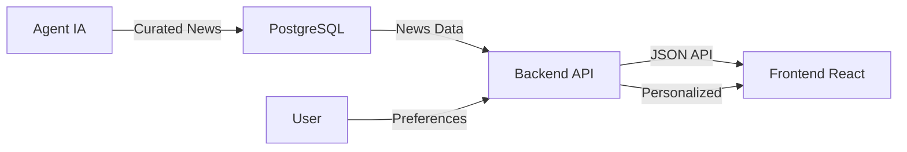

# 🚀 Newsletter Backend - API REST Inteligente

Backend robusto para sistema de newsletter com autenticação JWT, preferências de usuário e integração com IA para curadoria de notícias.

## 🎯 Sobre o Projeto

Este é o **backend do ecossistema Newsletter**, responsável por:
- ✅ **Servir notícias** com paginação e filtros avançados
- ✅ **Sistema de autenticação** completo com JWT
- ✅ **Gerenciamento de preferências** por usuário
- ✅ **API REST bem estruturada** seguindo padrões SOLID
- ✅ **Documentação interativa** com Swagger

### 📋 Requisitos Atendidos

#### 🔥 Essencial (Implementado)
- ✅ `GET /news` - Rota principal com paginação e filtros de período
- ✅ Backend organizado e bem estruturado
- ✅ Integração completa com banco de dados

#### 🌟 Bônus (Implementado)
- ✅ `POST /auth/register` - Cadastro de usuários com senha segura (bcrypt)
- ✅ `POST /auth/login` - Login com JWT token
- ✅ Proteção de rotas com middleware de autenticação
- ✅ `GET /preferences` - Listar categorias disponíveis
- ✅ `GET /users/me/preferences` - Preferências do usuário logado
- ✅ `PUT /users/me/preferences` - Atualizar preferências
- ✅ Sistema completo de perfil do usuário
- ✅ Documentação Swagger interativa

## 📚 Documentação da API

### 🌟 Swagger UI - Documentação Interativa
**Acesse em: http://localhost:3333/docs**

A documentação completa da API está disponível através do Swagger UI, onde você pode:
- 📖 **Ver todos os endpoints** organizados por categoria
- 🧪 **Testar as APIs** diretamente na interface
- 🔐 **Configurar autenticação** JWT para rotas protegidas
- 📝 **Ver exemplos** de request/response
- ✅ **Validar dados** de entrada automaticamente

## 🚀 Quick Start - Instalação e Execução

### 📋 Pré-requisitos
- Node.js 18+
- Docker e Docker Compose
- Git

### ⚡ Instalação Rápida
```bash
# 1. Clonar repositório
git clone <repo-url>
cd newsletter_backend

# 2. Instalar dependências
npm install

# 3. Subir banco PostgreSQL
docker compose up -d

# 4. Configurar banco de dados
npx prisma migrate dev
npx prisma db seed

# 5. Iniciar servidor
npm run dev
```

### 🎉 Pronto! Agora você pode:
- **🌐 API disponível em**: http://localhost:3333
- **📚 Documentação Swagger**: http://localhost:3333/docs
- **🗄️ Prisma Studio**: `npx prisma studio`

### 🔧 Scripts Principais
```bash
npm run dev          # 🚀 Desenvolvimento (watch mode)
npm run build        # 📦 Build para produção
npm start           # ▶️  Executar produção
npm run test        # 🧪 Executar testes
```

## 🛠️ Decisões Técnicas e Tecnologias

### 🎯 Por que Node.js + Fastify?
**Escolhi Node.js por compatibilidade** com todo o ecossistema e **Fastify ao invés de NestJS** porque:
- ✅ **Compatibilidade total**: Frontend (React) e Agent (Node.js) usam JavaScript/TypeScript
- ✅ **Código compartilhado**: Types, utils e validações podem ser reutilizados
- ✅ **Stack unificado**: Uma linguagem para todo o ecossistema
- ✅ **Performance superior**: Fastify é mais rápido que Express
- ✅ **Menos opinativo**: Permite criar arquitetura personalizada
- ✅ **Flexibilidade**: Posso implementar patterns conforme projeto cresce

### 🗄️ Por que SQL (PostgreSQL) ao invés de NoSQL?
**Escolhi PostgreSQL** especificamente para este projeto porque:

#### 📊 **Estrutura de Dados Newsletter**
- ✅ **Relacionamentos bem definidos**: User → Preferences → Categories → News
- ✅ **Integridade referencial**: Crítica para preferências e autenticação
- ✅ **Consultas complexas**: Filtros por categoria, período, preferências do usuário
- ✅ **ACID Transactions**: Essencial para operações de login/preferências

#### 🔍 **Casos de Uso Específicos**
- ✅ **Joins eficientes**: `SELECT news WHERE category IN (user.preferences)`
- ✅ **Aggregations**: Contadores, paginação, estatísticas de uso
- ✅ **Data consistency**: Preferências não podem referenciar categorias inexistentes
- ✅ **Schema evolution**: Migrations controladas conforme produto evolui

#### 🚫 **Por que NoSQL não faria sentido aqui**
- ❌ **Relacionamentos**: MongoDB exigiria múltiplas queries para dados relacionados
- ❌ **Consistência**: Eventual consistency problemática para autenticação
- ❌ **Query complexity**: Filtros por preferências seriam mais complexos
- ❌ **Over-engineering**: NoSQL seria overkill para este volume/estrutura

#### 🎯 **PostgreSQL + Prisma = Melhor dos Dois Mundos**
- ✅ **Relacional quando precisa**: Joins e constraints
- ✅ **JSON quando faz sentido**: Campos flexíveis se necessário
- ✅ **Type Safety**: Prisma gera tipos TypeScript automaticamente
- ✅ **Developer Experience**: Migrations, studio, query builder
- ✅ **Performance**: Índices otimizados para queries de newsletter

### 🔐 Por que JOSE + bcryptjs?
**JOSE** para JWT e **bcryptjs** para hashing:
- ✅ **Zero Dependencies**: JOSE não tem dependências externas
- ✅ **Maintained**: Mais atualizada que jsonwebtoken
- ✅ **Security**: bcryptjs é battle-tested e sem dependências nativas
- ✅ **Cross-platform**: Funciona em qualquer ambiente

### 📚 Por que Swagger?
**Documentação interativa** essencial para APIs:
- ✅ **Auto-generated**: Schemas gerados automaticamente das rotas
- ✅ **Interactive Testing**: Testar endpoints direto na documentação
- ✅ **Team Collaboration**: Frontend pode testar sem implementar
- ✅ **API Contract**: Define contrato claro entre frontend/backend

## 🏗️ Arquitetura e Design Patterns

### 🎨 Patterns Implementados

#### 1. **Factory Pattern**
```typescript
// Centraliza criação de use cases
class UseCaseFactory {
  static createRegisterUserUseCase() {
    const repository = RepositoryFactory.createUsersRepository();
    return new RegisterUserUseCase(repository);
  }
}
```

#### 2. **Repository Pattern**
```typescript
// Abstrai acesso a dados
interface UsersRepository {
  findByEmail(email: string): Promise<User | null>;
  create(data: CreateUserData): Promise<User>;
}
```

#### 3. **Use Case Pattern (Clean Architecture)**
```typescript
// Regras de negócio isoladas
class RegisterUserUseCase {
  async execute({ email, name, password }: RegisterUserRequest) {
    // Lógica de negócio aqui
  }
}
```

#### 4. **Entity Pattern (Domain Objects)**
```typescript
// Representa objetos do domínio
class User {
  constructor(
    public id: string,
    public name: string,
    public email: string
  ) {}
}
```

### 🔧 SOLID Principles

#### **S** - Single Responsibility
- Cada classe tem **uma única responsabilidade**
- Controllers só lidam com HTTP
- Use Cases só têm regras de negócio
- Repositories só acessam dados

#### **O** - Open/Closed
- **Extensível via interfaces**
- Novos repositories implementam mesma interface
- Novos use cases seguem mesmo padrão

#### **L** - Liskov Substitution
- **In-memory repositories** para testes
- **Prisma repositories** para produção
- Ambos implementam mesma interface

#### **I** - Interface Segregation
- **Interfaces específicas** por responsabilidade
- `UsersRepository`, `NewsRepository`, `CategoriesRepository`

#### **D** - Dependency Inversion
- **Use Cases dependem de abstrações**
- Repositories injetados via Factory
- Fácil para testes e manutenção

### 📁 Estrutura do Projeto
```
src/
├── app.ts                 # Configuração Fastify + Swagger
├── server.ts             # Entry point
├── entities/             # Domain objects
├── factories/            # Factory pattern (DI)
├── http/
│   ├── controllers/      # HTTP handlers
│   ├── middlewares/      # Auth, CORS, etc
│   └── routes.ts         # Route definitions + Swagger
├── repositories/         # Data access layer
│   ├── prisma/          # Prisma implementations
│   └── in-memory/       # Test implementations
├── use-cases/           # Business logic
├── service/             # External services (JWT, Hash)
└── test/                # Test utilities
```

## 📡 API Endpoints

### 🔓 Autenticação (Públicas)
- `POST /auth/register` - Registro de novo usuário
  - **Body**: `{ name, email, password }`
  - **Response**: Status 201 (Created)
- `POST /auth/login` - Login de usuário 
  - **Body**: `{ email, password }`
  - **Response**: `{ token, user }`

### 📰 Notícias (Protegidas - requer JWT)
- `GET /news` - Buscar notícias com paginação e filtros
  - **Query**: `?page=1&limit=10&period=week&category=tech`
  - **Response**: `{ news: [], pagination: {} }`
- `GET /news/:id` - Obter detalhes de uma notícia específica
  - **Response**: `{ news: { id, title, content, ... } }`

### 🏷️ Categorias (Protegidas - requer JWT)
- `GET /categories` - Buscar todas as categorias disponíveis
  - **Response**: `{ categories: [{ id, name, description }] }`

### ⚙️ Preferências (Protegidas - requer JWT)
- `GET /preferences` - Listar categorias disponíveis para preferências
- `GET /users/me/preferences` - Obter preferências do usuário atual
- `PUT /users/me/preferences` - Atualizar preferências
  - **Body**: `{ categoryIds: [1, 2, 3] }`

### 👤 Perfil (Protegidas - requer JWT)
- `GET /user/profile` - Obter perfil completo (dados + preferências)
- `PUT /user/profile` - Atualizar perfil do usuário
  - **Body**: `{ name: "Novo Nome" }`

### 🔐 Autenticação JWT
Todas as rotas protegidas requerem o header:
```
Authorization: Bearer <seu_jwt_token>
```

### 🎯 Como Testar as APIs no Swagger:
1. **Inicie o servidor**: `npm run dev`
2. **Acesse a documentação**: http://localhost:3333/docs
3. **Para rotas protegidas**:
   - Registre um usuário em `/auth/register`
   - Faça login em `/auth/login` e copie o token
   - Clique em **"Authorize"** no Swagger UI
   - Cole o token: `Bearer SEU_TOKEN_AQUI`
   - Teste todas as rotas protegidas! 🚀

## 🚀 Scripts Disponíveis

### 📦 Aplicação
```bash
npm run dev          # Rodar em desenvolvimento
npm run build        # Build para produção
npm start           # Rodar produção
npm run test        # Executar testes
```

### 🗄️ Banco de Dados
```bash
# Docker
docker compose up -d              # Subir PostgreSQL

# Prisma
npx prisma studio                 # Interface visual do banco
npx prisma migrate dev            # Aplicar migrações
npx prisma generate              # Gerar cliente Prisma
npx prisma db seed               # Popular com dados de teste
npx prisma migrate reset         # Reset completo do banco
```

### 🔧 URLs Importantes
```bash
# API Base
http://localhost:3333            # API REST

# Documentação
http://localhost:3333/docs       # 📚 Swagger UI

# Ferramentas
npx prisma studio               # 🗄️ Interface visual do banco
```

## 🧪 Testes

### 🎯 Estratégia de Testes
- **Unit Tests**: Use cases com repositories in-memory
- **Integration Tests**: Controllers com banco de teste
- **E2E Tests**: Fluxo completo via HTTP

### 📊 Cobertura de Testes
```bash
npm run test                     # Executar todos os tests
npm run test:coverage           # Ver cobertura
npm run test:watch              # Modo watch
```

### 🔍 Exemplo de Teste
```typescript
describe('Register User Use Case', () => {
  it('should register a new user', async () => {
    const usersRepository = new InMemoryUsersRepository();
    const registerUseCase = new RegisterUserUseCase(usersRepository);
    
    const userData = {
      name: 'João Silva',
      email: 'joao@example.com',
      password: 'senha123'
    };
    
    await registerUseCase.execute(userData);
    
    const user = await usersRepository.findByEmail('joao@example.com');
    expect(user).toBeDefined();
    expect(user?.name).toBe('João Silva');
  });
});
```

## 🌐 Integração com Ecossistema

Este backend faz parte do **ecossistema Newsletter**:
- **🖥️ Frontend**: React + Vite + TypeScript
- **🤖 Agent**: Sistema de curadoria inteligente com IA
- **⚡ Backend**: Esta API REST (você está aqui!)

### 🔄 Fluxo de Dados


## 🚀 Roadmap e Melhorias Futuras

### 📊 Monitoramento
- **Health Checks**: Endpoints de saúde da aplicação
- **Logging**: Estruturado com Winston
- **Metrics**: Prometheus + Grafana
- **APM**: Application Performance Monitoring

### 🔒 Segurança
- **Rate Limiting**: Controle de requisições por IP
- **CORS Configurável**: Políticas por ambiente
- **Input Validation**: Sanitização avançada
- **Security Headers**: Helmet.js

### 📨 Notificações
- **Email Service**: Confirmação de cadastro
- **Push Notifications**: Notícias importantes
- **Newsletter**: Envio periódico personalizado
- **Webhooks**: Integração com sistemas externos

### 🚀 Performance
- **Caching**: Redis para cache de queries
- **Database Optimization**: Índices e query optimization
- **CDN**: Assets estáticos
- **Load Balancing**: Múltiplas instâncias

### 🧪 Qualidade
- **E2E Testing**: Cypress/Playwright
- **Load Testing**: Artillery/K6
- **Security Testing**: OWASP ZAP
- **Code Quality**: SonarQube